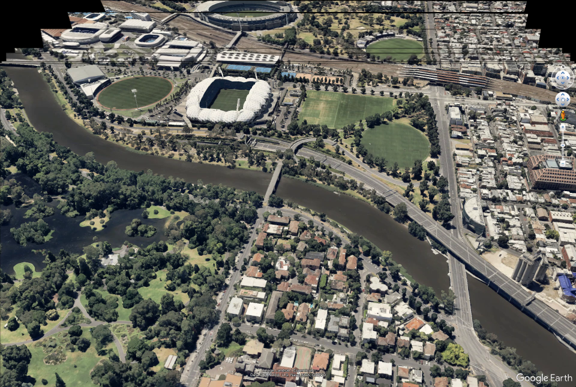
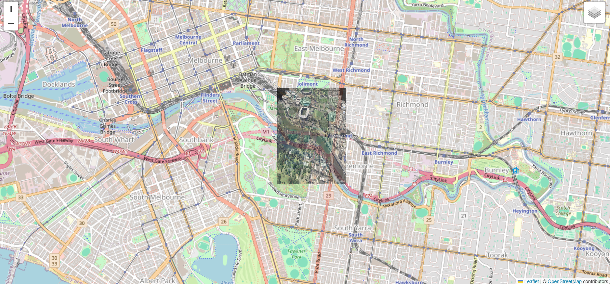
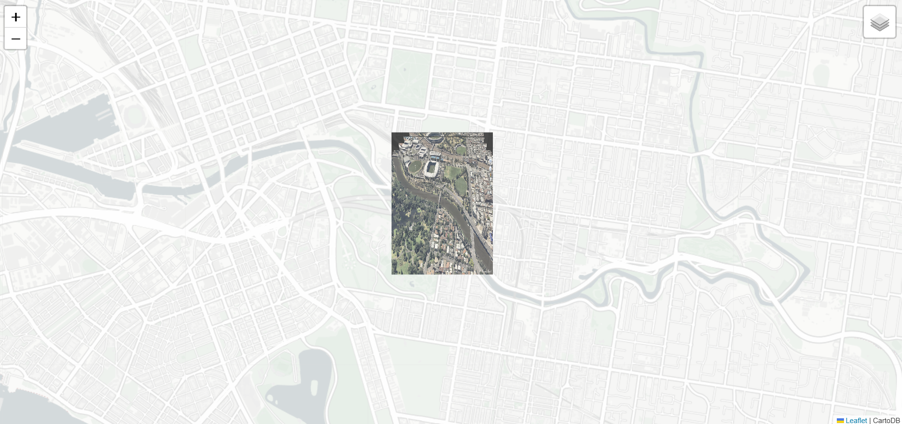

# GeoStitch

**Georeferenced Drone Footage Video to Stitched Image → Superimposed on Map**

## Objective

The goal of this project is to process georeferenced drone video footage and convert it into a geospatially aligned, stitched image. This output is suitable for training AI models in applications such as remote sensing, environmental monitoring, and geographic analysis.

## Workflow

### 1. **Video Acquisition**

- Georeferenced video footage is acquired from Google Earth Pro, containing clear landmarks that assist in the image stitching process.

### 2. **Frame Extraction**

- Frames are extracted from the video at regular intervals (every 1 second), and saved in a lossless format (PNG) for high-quality processing.

### 3. **Image Stitching**

The image stitching process involves several steps to create a seamless panorama:

- **Pre-processing:** Black borders are removed from each image. A function converts the image to grayscale, thresholds it, and crops out the black regions based on detected contours.
  
- **Feature Matching:** SIFT (Scale-Invariant Feature Transform) is used to detect features and compute descriptors. Keypoints between adjacent frames are matched, and a homography transformation matrix is computed using RANSAC to align the second image to the first.

- **Stitching:** The process is repeated for all frames, progressively stitching them together. The final stitched image is cropped to remove residual black borders. It is then displayed using Matplotlib and saved as a high-quality PNG file. This method ensures a smooth and accurate stitch with minimal artifacts.

### 4. **Geo-referencing & Superimposition**

The geo-referencing process for the stitched image involves the following steps:

- **Assigning Geocoordinates:** Geocoordinates (latitude and longitude) are manually assigned to the four corners of the stitched image. These coordinates are obtained from a georeferencing tool like Google Earth Pro.
  
- **Ground Control Points (GCPs):** GCPs are defined for the top-left, top-right, bottom-left, and bottom-right corners of the image.

- **Transformation:** Using the `from_gcps` function from the `rasterio` library, a transformation matrix is created from the GCPs. This matrix aligns the image with geographic coordinates.

- **Saving as GeoTIFF:** The image is saved as a GeoTIFF file, a standard format for geospatial data. The transformation matrix is applied, and the coordinate reference system (CRS) is set to WGS84 (EPSG:4326).

### 5. **Visualization**

The final step is to visualize the georeferenced stitched image on an interactive map:

- **Loading the GeoTIFF:** The GeoTIFF image is loaded using `rasterio`. The image's RGB channels are extracted, and the image bounds are obtained and transformed into the WGS84 coordinate reference system (EPSG:4326).

- **Encoding Image for Display:** The image is encoded into PNG format and embedded as a base64 string for display on the map.

- **Creating the Map:** A `folium` map is created, centered on the geographic center of the image bounds. A clean basemap (CartoDB’s "Positron No Labels") is added to the map. The georeferenced image is overlaid using `folium.raster_layers.ImageOverlay`, accurately positioned based on its geospatial bounds. The overlay's opacity is adjusted for better visualization.

- **Interactive Features:** The map includes interactive features like zooming, panning, and a layer control to toggle the overlay layer. The map is saved as an HTML file that can be opened in any web browser.

## Deliverables

The project delivers the following outputs:

- Raw stitched image in PNG format.

- Georeferenced map overlay, properly aligned with geographic coordinates, saved as an interactive HTML file.

- Account of any manual adjustments made to coordinate alignment during the geo-referencing process.
    1. **Ground Control Points (GCPs) Adjustment:**  
    Initially, the coordinates from Google Earth Pro were used for the four corners of the image. These were refined manually to ensure a more accurate match with the real-world locations.

    2. **Transformation Corrections:**  
    The transformation matrix was adjusted when the first geo-referencing attempt showed misalignments, refining the fit between the image and the map.

    3. **Image Cropping and Alignment:**  
    After stitching, residual black borders were cropped manually to ensure the final image fit perfectly with the map, removing any distortions.

    4. **Reprojection Corrections:**  
    In some cases, the initial projection didn't match WGS84 (EPSG:4326) perfectly, requiring manual adjustments or reprojection for proper alignment.

    5. **Fine-Tuning GeoTIFF Matrix:**  
    Adjustments were made to the transformation matrix parameters (scale, rotation, translation) to further refine the alignment of the image on the map.

